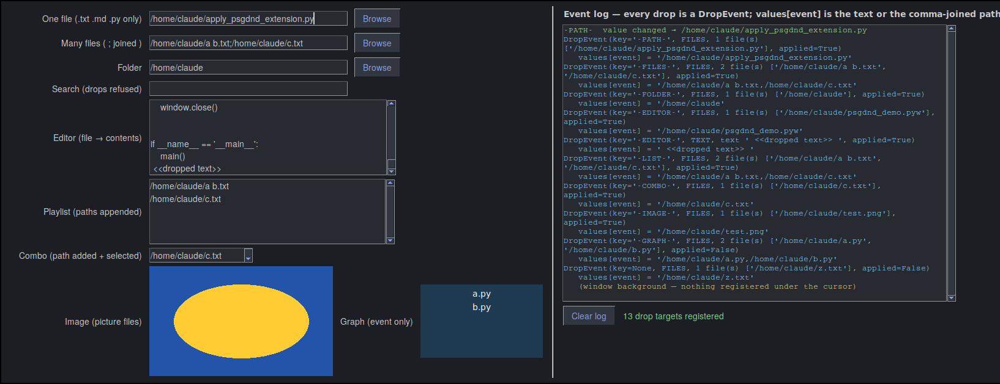
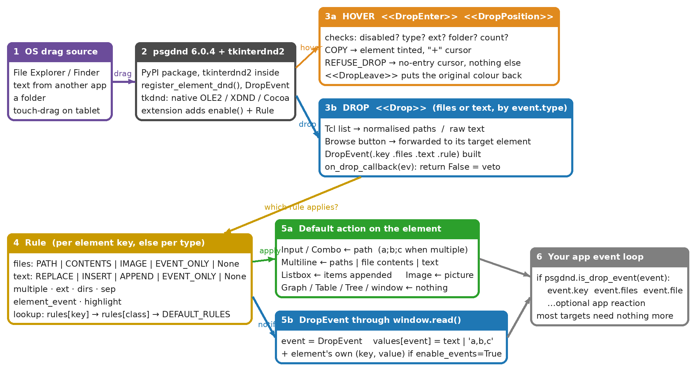
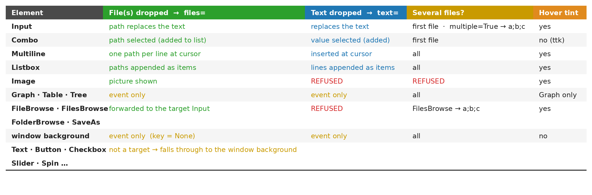

# psgdnd


# AI Alert... 

 

Our collective favorite topic.  Just a quick disclosure about the new code and this readme.  The 6.0.5 code contains some changes made by Claude Fable 5.  This readme was also updated by Claude.  

If I didn't think it did as good or better job than I would (it's a **lot** better than I am), then I wouldn't be using it.  These changes, adding a Rules design while keeping the code backwards compatible, and easy to understand documentation are impressive enough to release. 

### Drag and Drop for PySimpleGUI

Drop files, folders and text from File Explorer, Finder, a browser or any other application straight onto the elements of a
PySimpleGUI window. One call turns every input-type element into a drop target that does the obvious thing — a path lands in an
Input, lines in a Multiline, items in a Listbox, a picture in an Image — and your event loop is told about it.

psgdnd is a separate package built on [tkinterdnd2](https://pypi.org/project/tkinterdnd2/). It works with an unmodified
PySimpleGUI 6 on Windows, macOS and Linux (X11).

---

## Try it in 60 seconds

```
python -m pip install --upgrade psgdnd        # from PyPI (installs tkinterdnd2 too)
python -m psgdnd                              # opens the demo window — drag anything onto it
```

Latest code straight from this repo (not yet on PyPI):

```
python -m pip install --upgrade https://github.com/PySimpleGUI/psgdnd/zipball/main
```



---

## Add it to your program: 2 lines

```python
import PySimpleGUI as sg
import psgdnd                                           # 1

layout = [[sg.Text('File to process'), sg.Input(key='-FILE-', enable_events=True, expand_x=True), sg.FileBrowse()],
          [sg.Multiline(size=(60, 8), key='-NOTES-')],
          [sg.Button('OK'), sg.Button('Cancel')]]
window = sg.Window('Drop something on me', layout, finalize=True)

psgdnd.enable(window)                                   # 2  every input-type element is now a drop target

while True:
    event, values = window.read()
    if event in (sg.WIN_CLOSED, 'Cancel'):
        break
    if psgdnd.is_drop_event(event):                     # optional — react to a drop
        print(event.key, event.files, event.text)
window.close()
```

Drop a file on the Input and its path appears there; because the Input has `enable_events=True`, its own event fires just as
if the user had typed. Drop text on the Multiline and it is inserted at the cursor. Drop something on the Browse button and it
goes to the Input the button belongs to. While you hover, the element tints blue if the drop will be accepted, or the cursor
turns to a no-entry sign if it won't.

---

## What happens when something is dropped



1. **tkinterdnd2** receives the native drag and psgdnd wires it into your window.
2. **Hover** — the element's `Rule` is checked (enabled? files or text? extension? folder? how many?). Accept → tint + "+" cursor. Refuse → no-entry cursor.
3. **Drop** — the payload becomes a list of paths or a string of text.
4. The **Rule** decides the **default action** and psgdnd performs it on the element.
5. A **`DropEvent`** arrives through `window.read()` as the event; `values[event]` holds the raw payload.

Most elements need nothing in the event loop — step 4 already did what the user expects.

---

## What each element does by default



Elements with `enable_events=True` also get their own `(key, value)` event after the drop, so existing code keeps working.

---

## Changing the behaviour: Rules

List only the exceptions; everything else keeps its default.

```python
DND_RULES = {'-MIDI-':   psgdnd.Rule(ext=('.mid', '.midi')),                     # one file, only these extensions
             '-QUEUE-':  psgdnd.Rule(multiple=True),                              # several files, joined with ';'
             '-EDITOR-': psgdnd.Rule(files=psgdnd.CONTENTS, text=psgdnd.INSERT),  # a dropped text file is loaded into the Multiline
             '-NOTES-':  psgdnd.Rule(files=None),                                 # text only, file drops refused
             sg.Listbox: psgdnd.Rule(files=psgdnd.EVENT_ONLY)}                    # every Listbox: report the drop, don't touch it
DND_SKIP = ['-SEARCH-']                                                           # never drop targets

psgdnd.enable(window, rules=DND_RULES, skip=DND_SKIP)
```

| `Rule(...)` | Values | Meaning |
|---|---|---|
| `files=` | `PATH` `CONTENTS` `IMAGE` `EVENT_ONLY` `None` | what to do with dropped files (`None` = refuse) |
| `text=` | `REPLACE` `INSERT` `APPEND` `EVENT_ONLY` `None` | what to do with dropped text (`None` = refuse) |
| `multiple=` | `bool` | accept several files (Input/Combo join them with `sep`) |
| `ext=` | tuple | accepted extensions, e.g. `('.png', '.jpg')` |
| `dirs=` | `bool` (True) | accept folders |
| `sep=` | `str` (`';'`) | joiner for multiple paths in an Input/Combo |
| `element_event=` | `bool` / `None` | also fire the element's own event (`None` = only if `enable_events=True`) |
| `highlight=` | `bool` (True) | tint the element while hovering |

Lookup order: `rules[key]` → `rules[ElementClass]` → the built-in default for the element type.
`enable()` also takes `window_rule=` (drops on the window background; `None` = refuse) and `on_drop_callback=` (called before the
default action; return `False` to cancel it). `target()` / `untarget()` add or remove one element after `enable()`.

---

## The DropEvent

| | |
|---|---|
| `event.key` | key of the element dropped on — `None` for the window background |
| `event.element` | the element |
| `event.files` / `event.file` | list of paths (empty for text) / the first path |
| `event.text` | dropped text (`None` for files) |
| `event.drop_type` | `DROP_TYPE_FILES`, `DROP_TYPE_TEXT`, `DROP_TYPE_UNKNOWN` |
| `event.applied` | `True` if psgdnd's default action changed the element |
| `values[event]` | raw payload: the text, or the paths joined with `,` |

```python
if psgdnd.is_drop_event(event):
    if event.key == '-GRAPH-':
        show_preview(event.file)
    elif event.key is None:                              # dropped on the window itself
        open_document(event.file)
```

---

## The classic API (still there)

Elements can also be registered one at a time. No default action, no hover feedback — the `DropEvent` arrives and your code does the rest.

```python
psgdnd.register_element_dnd(window['-INPUT-'], window, psgdnd.DROP_TYPE_FILES)   # DROP_TYPE_TEXT / DROP_TYPE_FILES / DROP_TYPE_ALL
```

Don't register the same element both ways.

---

## Demo programs

| Program | What it shows |
|---|---|
| `python -m psgdnd` | every default behaviour plus a few Rule overrides, with an event log |
| `Demo Programs/psgdnd_demo.py` | the same window as an ordinary standalone program — start here when adding psgdnd to your own code |
| `Demo Programs/Demo_Drag_and_Drop_Onto_Icon.pyw` | a desktop icon you drop files onto: image format conversion, English ↔ Spanish translation |

---

## Platform notes

* Drops **into** your window only; dragging out of a window is not part of psgdnd.
* **Windows** — the payload is known while hovering, so extension filtering shows the no-entry cursor before you let go.
* **Linux** — X11 only; drag and drop does not work under Wayland. Use 6.0.4 or later (earlier releases had Linux issues).
* **macOS** — not yet verified. Reports welcome.
* ttk-based elements (Combo, Table, Tree) can't be tinted; the cursor still shows accept/refuse.

---

## License & Copyright

Copyright 2026 PySimpleGUI. All rights reserved.

Licensed under LGPL3.

## Contributing

We are happy to receive issues describing bug reports and feature requests! If your bug report relates to a security
vulnerability, please do not file a public issue, and please instead reach out to us at issues@PySimpleGUI.com.

We do not accept (and do not wish to receive) contributions of user-created or third-party code, including patches, pull
requests, or code snippets incorporated into submitted issues. Please do not send us any such code! Bug reports and feature
requests should not include any source code.

If you nonetheless submit any user-created or third-party code to us, (1) you assign to us all rights and title in or relating
to the code; and (2) to the extent any such assignment is not fully effective, you hereby grant to us a royalty-free, perpetual,
irrevocable, worldwide, unlimited, sublicensable, transferrable license under all intellectual property rights embodied therein
or relating thereto, to exploit the code in any manner we choose, including to incorporate the code into PySimpleGUI and to
redistribute it under any terms at our discretion.
