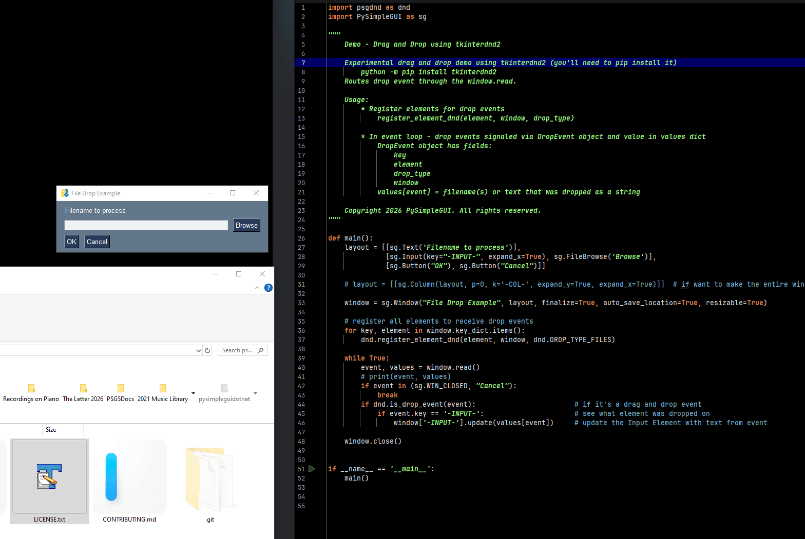

<p align="center">
  <p align="center"><p>

  <h2 align="center">psgdnd</h2>
  <h2 align="center">Drag and Drop for PySimpleGUI</h2>
</p>

<p align="center"><p>


## Description

Finally drag and drop!  The long wait for drag-and-drop in the Tkinter port of PySimpleGUI might soon be over.  `psgdnd` is a prototype release for using `tkinterdnd2` to provide drag and drop functionality.  In theory, this will work with all existing versions of PySimpleGUI.

`psgdnd` integrates `tkinterdnd2` with `PySimpleGUI` and provides interfaces that are easy to use in a PySimpleGUI application.

This is super-early stage code and design, very much a work in progress.  More experimenation and education needed, but in the meantime, give it a try and see if it'll meet your needs.


## Installation using Pip

The `psgdnd` package is still at an early stage and not ready for distribution on PyPI.  Instead you can pip install it from this repo by running:

```bash
python -m pip install --upgrade https://github.com/PySimpleGUI/psgdnd/zipball/main
```


## Usage

To add drag and drop support to your window:

1. Import `psgdnd2` into your code
2. Register which elements you want to accept drop events and the type drops to accept
3. Add processing of Drop Events to your event loop

### Demo Programs

There are a couple Demo Programs located in the folder Demo Programs.  One is a very simple example that's shown below. The other is a desktop icon that can be dropped onto.

#### Simple File Drop
This simple example will accept filenames dropped onto the Input element. When dropped, the input element is updated to the filename or list of filenames.

```python
import psgdnd as dnd
import PySimpleGUI as sg

"""
    Demo - Drag and Drop using tkinterdnd2

    Experimental drag and drop demo using tkinterdnd2 (you'll need to pip install it)
        python -m pip install tkinterdnd2
    Routes drop event through the window.read.

    Usage:
        * Register elements for drop events
            register_element_dnd(element, window, drop_type)

        * In event loop - drop events signaled via DropEvent object and value in values dict
            DropEvent object has fields:
                key
                element
                drop_type
                window
            values[event] = filename(s) or text that was dropped as a string            

    Copyright 2026 PySimpleGUI. All rights reserved.
"""


def main():
    layout = [[sg.Text('Filename to process')],
              [sg.Input(key="-INPUT-", expand_x=True), sg.FileBrowse('Browse')],
              [sg.Button("OK"), sg.Button("Cancel")]]

    # layout = [[sg.Column(layout, p=0, k='-COL-', expand_y=True, expand_x=True)]]  # if want to make the entire window the target

    window = sg.Window("File Drop Example", layout, finalize=True, auto_save_location=True, resizable=True)

    # register all elements to receive drop events
    for key, element in window.key_dict.items():
        dnd.register_element_dnd(element, window, dnd.DROP_TYPE_FILES)

    while True:
        event, values = window.read()
        # print(event, values)
        if event in (sg.WIN_CLOSED, "Cancel"):
            break
        if dnd.is_drop_event(event):                        # if it's a drag and drop event
            if event.key == '-INPUT-':                      # see what element was dropped on
                window['-INPUT-'].update(values[event])     # update the Input Element with text from event

    window.close()


if __name__ == '__main__':
    main()
```

#### Drop Onto Icon

`Demo_Drag_and_Drop_Onto_Icon.pyw` is a Drag and Drop program I've wanted to create using PySimpleGUI for a long time. It wasn't possible until `psgdnd` was released this month.  It has operations I frequently use such as image format conversions and translating to/from English and Spanish.


https://github.com/user-attachments/assets/6919a166-2014-469b-8b4a-651413a8a12e


## License & Copyright

Copyright 2026 PySimpleGUI.  All rights reserved.

Licensed under LGPL3.

## Contributing

We are happy to receive issues describing bug reports and feature
requests! If your bug report relates to a security vulnerability,
please do not file a public issue, and please instead reach out to us
at issues@PySimpleGUI.com.

We do not accept (and do not wish to receive) contributions of
user-created or third-party code, including patches, pull requests, or
code snippets incorporated into submitted issues. Please do not send
us any such code! Bug reports and feature requests should not include
any source code.

If you nonetheless submit any user-created or third-party code to us,
(1) you assign to us all rights and title in or relating to the code;
and (2) to the extent any such assignment is not fully effective, you
hereby grant to us a royalty-free, perpetual, irrevocable, worldwide,
unlimited, sublicensable, transferrable license under all intellectual
property rights embodied therein or relating thereto, to exploit the
code in any manner we choose, including to incorporate the code into
PySimpleGUI and to redistribute it under any terms at our discretion.
